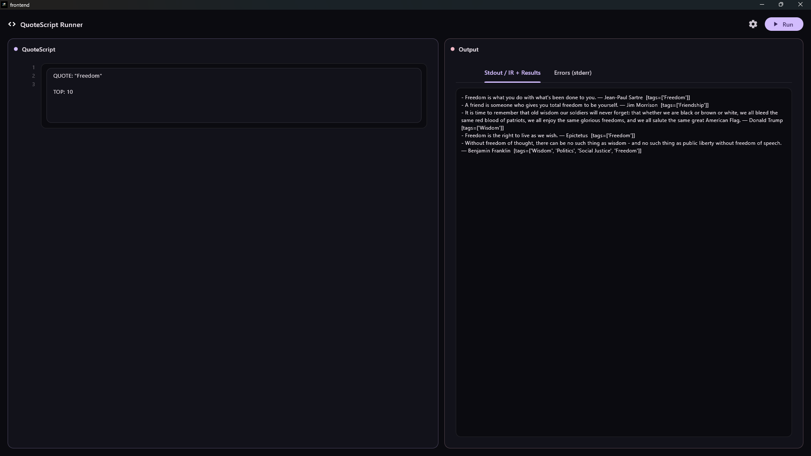

# QuoteScript

QuoteScript is a domain-specific language (DSL) for querying and exploring a quotes database. It is backed by a full compiler pipeline written in Python and surfaced through a Flutter desktop GUI.



## What is it?

QuoteScript lets you express what you want from a quotes collection in clean, human-readable syntax — and get back exactly that. Under the hood it goes through the classic compiler phases: lexing, parsing, semantic analysis, IR generation, optimisation, and execution. The result lands in a split-pane desktop interface where you write your script on the left and read your output on the right.

```
QUOTE: "Freedom"
TOP: 10
```

That's it. Run the script, get your quotes — filtered, ranked, tagged.

## How to Use

1. Open the QuoteScript desktop app (Flutter frontend)
2. Write your QuoteScript query in the left panel
3. Hit **Run**
4. View results under `Stdout / IR + Results`, or inspect `Errors (stderr)` if something went wrong

## DSL Reference

| Keyword | Description | Example |
|---|---|---|
| `QUOTE:` | Filter quotes by keyword or topic | `QUOTE: "Freedom"` |
| `TOP:` | Limit results to the top N | `TOP: 10` |

*(More keywords may be added as the language evolves. See `examples/` for sample scripts.)*

## How it Works

### Backend (Python — Compiler Pipeline)

The backend implements a classic compiler architecture. Each phase is its own module under `backend/src/`:

- **`lexer/`** — Tokenises the raw QuoteScript source
- **`parser/`** — Builds an AST from the token stream
- **`semantic/`** — Validates the AST (type checking, scope rules, etc.)
- **`ir/`** — Lowers the AST to an intermediate representation
- **`optimizer/`** — Applies optimisations over the IR
- **`executor/`** — Executes the IR against the quotes database
- **`common/`** — Shared utilities across phases
- **`pipeline.py`** — Wires all phases together end-to-end

The Flutter frontend invokes `python main.py` each time a script is run, keeping execution stateless.

### Frontend (Flutter — Desktop GUI)

The frontend lives in `frontend/lib/` and is split into:

- **`services/`** — Communicates with the Python backend (spawns process, reads stdout/stderr)
- **`ui/`** — The split-pane editor and output interface
- **`main.dart`** — Entry point

### Folder Structure

```
QuoteScript/
|---- backend/
|     |---- data/db/          (quotes database)
|     |---- examples/         (sample .qs scripts)
|     |---- src/
|     |     |---- lexer/
|     |     |---- parser/
|     |     |---- semantic/
|     |     |---- ir/
|     |     |---- optimizer/
|     |     |---- executor/
|     |     |---- common/
|     |     |---- pipeline.py
|     |---- main.py
|     |---- requirements.txt
|---- frontend/
|     |---- lib/
|     |     |---- services/
|     |     |---- ui/
|     |     |---- main.dart
```

## Why QuoteScript?

There is something to be said for having the right words at the right moment. Philosophers, leaders, poets — humanity has been distilling hard-won understanding into sentences for millennia.

QuoteScript started as a practical tool: I wanted to query a quotes database without writing boilerplate search logic every time. A small DSL felt like the right abstraction — expressive enough to be useful, constrained enough to stay simple. Building it as a real compiler rather than a string-matching hack was the more interesting path, and it made the whole thing more extensible.

The Flutter GUI made it feel like a real tool rather than a script you run in a terminal. The combination — a proper language, a proper pipeline, a proper interface — is the point.

## Credits

- Quotes database: [Luke Peavy — quotable-io/data](https://github.com/quotable-io/data)
- Compiler backend: Python
- Desktop GUI: Flutter / Dart
